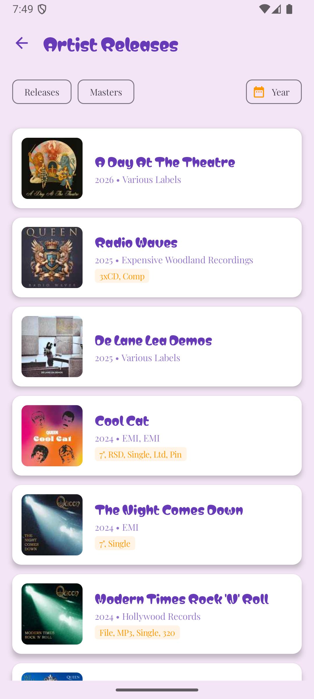
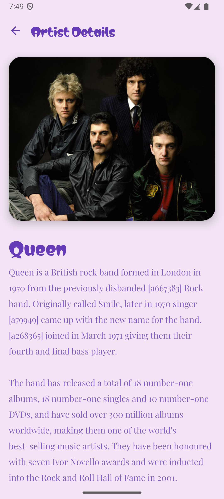
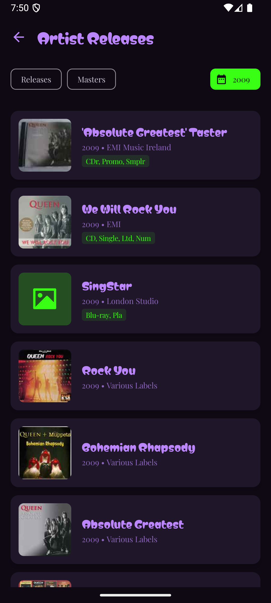
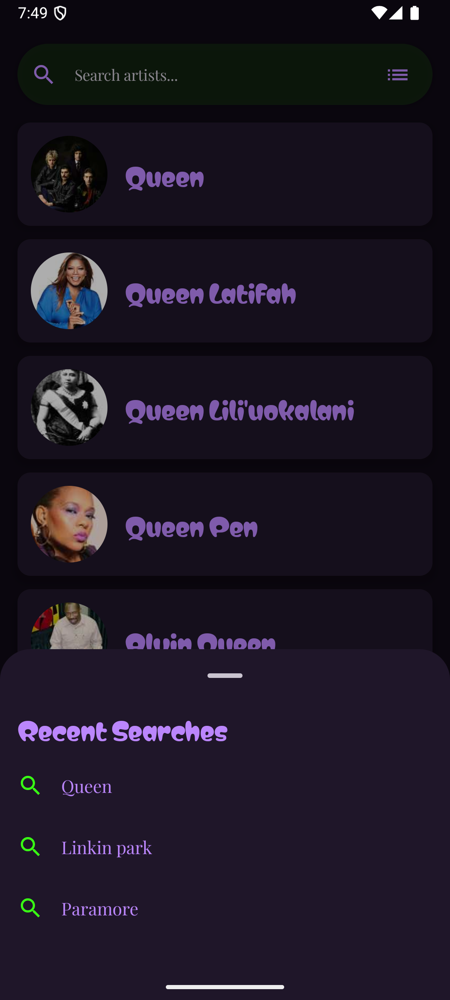
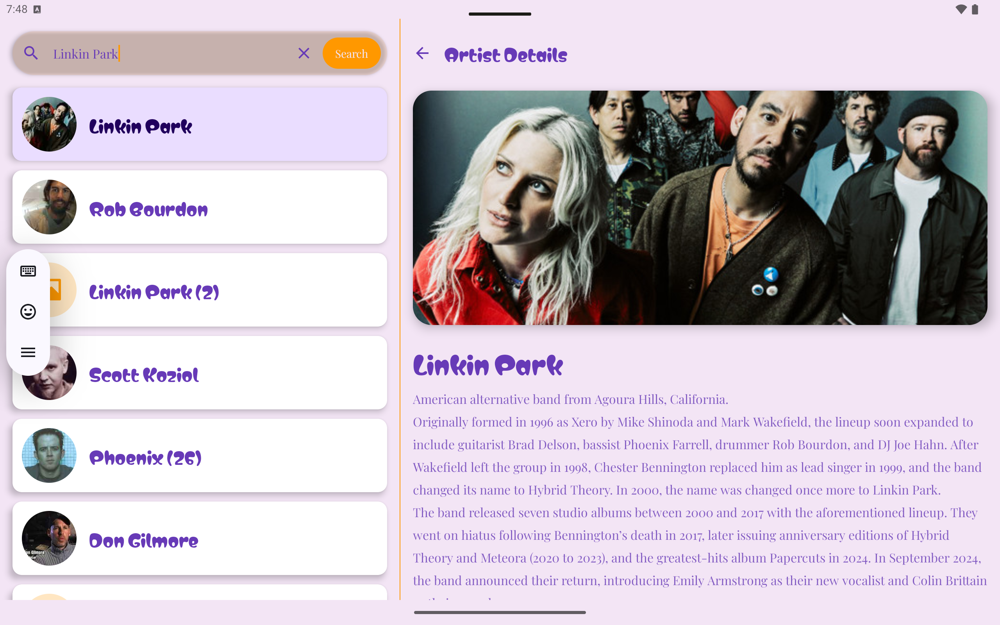
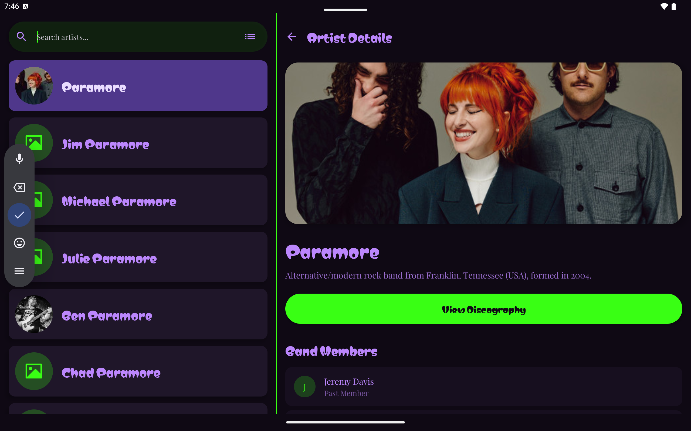
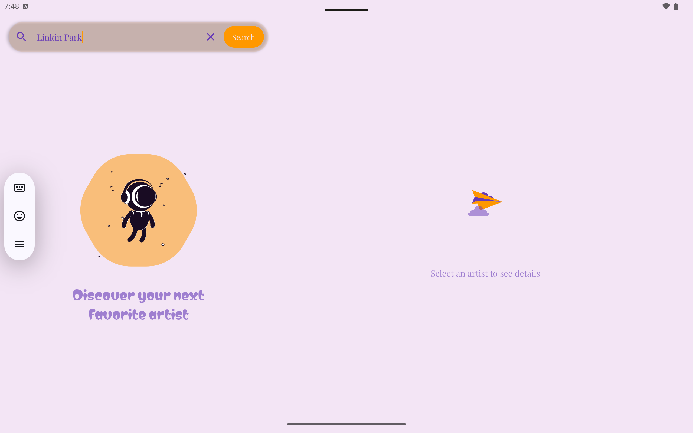
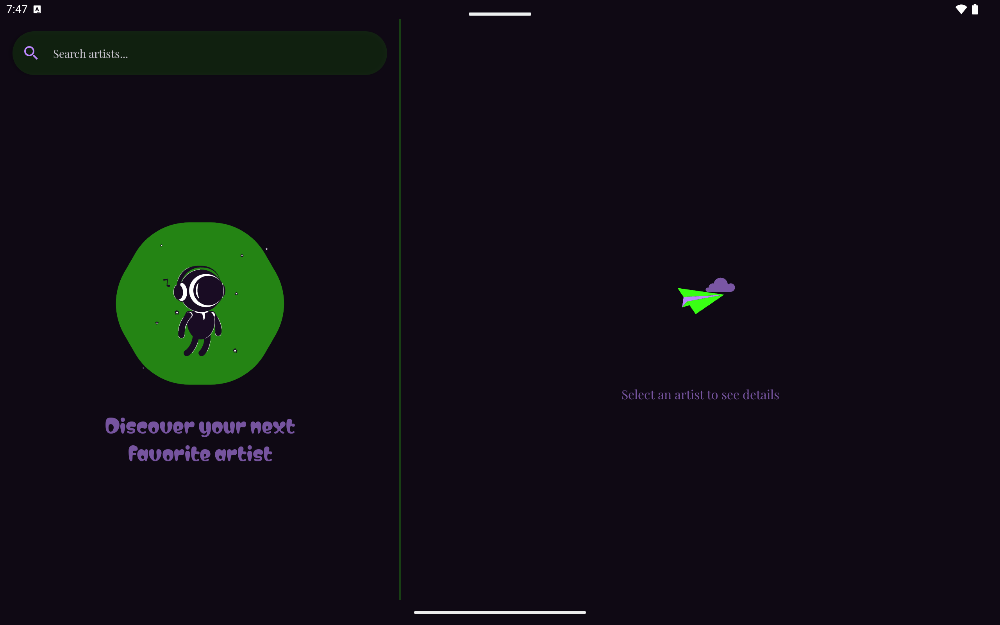

# Mobile Challenge - Discogs Artist Browser

A modern Android application built with Jetpack Compose that allows users to search for music artists, view their details, and explore their discography using the Discogs API.

## 🚀 Features

- **Artist Search**: Real-time search with pagination support (Paging 3).
- **Recent Searches**: Persistent-like history of the last 10 successful searches accessible via a BottomSheet.
- **Detailed Artist Info**: View artist profiles, images, and band members.
- **Discography Explorer**: Browse releases and masters with advanced filtering.
- **Advanced Filtering**: Filter releases by type (Release/Master) and by year using a dynamic dropdown.
- **Responsive Design**: Adaptive Two-Pane layout for tablets and expanded screens.
- **Modern UI/UX**:
    - Material 3 Design System.
    - Custom "Liquified" shapes using `androidx.graphics:graphics-shapes`.
    - Lottie animations for empty states and loading indicators.
    - Dark/Light mode support.

## 🛠 Architecture & Tech Stack

- **Architecture**: MVVM (Model-View-ViewModel) following Clean Architecture principles.
- **UI**: 100% Jetpack Compose.
- **Dependency Injection**: Hilt.
- **Networking**: Retrofit + OkHttp.
- **Pagination**: Paging 3.
- **Image Loading**: Coil.
- **Concurrency**: Kotlin Coroutines & Flow.
- **Navigation**: Compose Navigation.

## 🧪 Quality Assurance

- **Unit Testing**: ViewModels are covered by JUnit 4 and MockK to ensure state logic correctness.
- **Screenshot Testing**: Integrated **Paparazzi** for UI regression testing across different themes and states.
- **Static Analysis**: **Detekt** is configured to maintain code quality and adherence to Kotlin best practices.
- **Resource Management**: Complete extraction of strings and dimensions for maintainability and scalability.

## 📦 Getting Started

1. Clone the repository.
2. Open in Android Studio (Ladybug or newer recommended).
3. Ensure you have a valid Java Runtime (JDK 17+).
4. Run `./gradlew recordPaparazziDebug` to generate baseline screenshots.
5. Run `./gradlew detekt` to check code quality.
6. Build and run the `:app` module.

## 🛡️ Error Handling
The app gracefully handles:
- No search results (Empty state with animations).
- Network failures (Retry mechanism in all screens).
- Missing data (Placeholder images and strings).

### 📸 App Preview

#### 📱 Phone Experience
| Search (Light) | Details (Light) | Releases (Dark) | Recent Searches (Dark) |
|:---:|:---:|:---:|:---:|
|  |  |  |  |

#### 平板 Tablet Experience (Two-Pane)
| Search & Details (Light) | Search & Details (Dark) |
|:---:|:---:|
|  |  |

#### 🎨 Empty States & UI
| Empty Search (Light) | Empty Search (Dark) |
|:---:|:---:|
|  |  |
